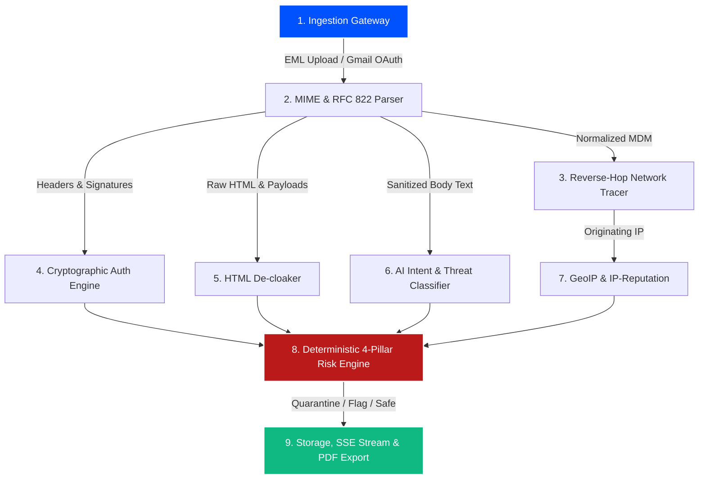

<div align="center">

# 🛡️ Mailiac

### **Enterprise-Grade AI Email Forensics & Automated Threat Hunting Pipeline**

*Precision Forensics · Cryptographic Verification · Semantic Intent Intelligence · Deterministic Risk Scoring*

[](https://www.typescriptlang.org/)
[](https://turbo.build/)
[](https://nextjs.org/)
[](https://expressjs.com/)
[](https://bullmq.io/)
[](https://www.mongodb.com/)
[](https://vitest.dev/)

---

[Key Features](#-key-features) •
[Forensics Pipeline](#-9-stage-asynchronous-forensic-pipeline) •
[Risk Engine & Math](#-deterministic-4-pillar-risk-engine) •
[Architecture](#-monorepo-architecture) •
[Quickstart](#-quickstart--local-setup) •
[Docs Hub](#-documentation-hub)

---

</div>

## 📌 Executive Summary

**Mailiac** is an asynchronous, high-throughput email forensics platform engineered to expose **Business Email Compromise (BEC)**, **spear phishing**, **lookalike domain spoofing**, **punycode/homoglyph attacks**, and **zero-width obfuscation**.

Unlike naive security tools that blindly forward untrusted email bodies to LLMs, Mailiac operates on a **Deterministic 4-Pillar Corroboration Architecture**. Generative AI is sandboxed as one of four independently weighted forensic pillars (*Identity 35%, AI Intent 35%, Crypto Auth 20%, Infrastructure 10%*), anchored by hard cryptographic verification (**SPF / DKIM / DMARC / Multi-Hop ARC**), reverse-hop network boundary tracing, and zero-downtime deterministic heuristic fallbacks.

```
                  ┌──────────────────────────────────────────────┐
                  │          INGESTION GATEWAY (Dual-Path)       │
                  │   Raw .EML Upload   OR   Gmail OAuth 2.0     │
                  └──────────────────────┬───────────────────────┘
                                         │
                                         ▼
                  ┌──────────────────────────────────────────────┐
                  │       RFC 822 MIME & ATTACHMENT PARSER       │
                  │  postal-mime + SHA-256 Hashing + Unicode     │
                  └──────────────────────┬───────────────────────┘
                                         │
                 ┌───────────────────────┴───────────────────────┐
                 │                                               │
                 ▼ (Parallel Phase 1)                            ▼ (Parallel Phase 2)
  ┌─────────────────────────────┐                 ┌─────────────────────────────┐
  │  REVERSE-HOP EVIDENCE TRACE │                 │   SEMANTIC AI INTENT (LLM)  │
  │  Received header traversal  │                 │   Gemini 3.6-flash + NLP    │
  ├─────────────────────────────┤                 ├─────────────────────────────┤
  │    CRYPTO AUTH VALIDATOR    │                 │   GEOIP & ASN ENRICHMENT    │
  │   SPF · DKIM · DMARC · ARC  │                 │    MaxMind / IP-API / ASN   │
  ├─────────────────────────────┤                 ├─────────────────────────────┤
  │   HTML DE-CLOAK & DEFANG    │                 │   IP REPUTATION & THREATS   │
  │ Zero-width chars, Glassworm │                 │    AbuseIPDB, Tor/VPN/Proxy │
  └──────────────┬──────────────┘                 └──────────────┬──────────────┘
                 │                                               │
                 └───────────────────────┬───────────────────────┘
                                         │
                                         ▼
                  ┌──────────────────────────────────────────────┐
                  │    DETERMINISTIC 4-PILLAR RISK AGGREGATOR    │
                  │   C1-C4 Circuit Breakers & Consensus Logic   │
                  └──────────────────────┬───────────────────────┘
                                         │
                 ┌───────────────────────┴───────────────────────┐
                 │                                               │
                 ▼                                               ▼
  ┌─────────────────────────────┐                 ┌─────────────────────────────┐
  │   SOC ANALYST WEB CONSOLE   │                 │   FORENSIC PDF 1.4 REPORT   │
  │  Real-time SSE Stream Logs  │                 │  SHA-256 Verified Evidence  │
  └─────────────────────────────┘                 └─────────────────────────────┘
```

---

## ✨ Key Features

| Capability | Description |
| :--- | :--- |
| **📥 Dual Ingestion Gateway** | Analyze raw `.eml` files (up to 20MB) or connect securely via on-demand Google Workspace / Gmail OAuth 2.0. |
| **🔍 Reverse-Hop Evidence Boundary** | Traces untrusted `Received:` headers back through relays to isolate the true originating infrastructure IP. |
| **🔐 Hard Cryptographic Auth** | Validates SPF, DKIM 1024/2048-bit RSA signatures, DMARC alignment (`strict` / `relaxed`), and Multi-Hop ARC chains. |
| **🧩 Anti-Obfuscation De-cloaking** | Strips zero-width unicode characters, invisible HTML CSS overlays, homoglyphic lookalikes, and defangs malicious URLs. |
| **🧠 Multi-Model & Multi-Key AI Router** | Automated failover across Gemini models (`gemini-3.1-flash-lite`, `gemini-3.5-flash`, `gemini-3.6-flash`), multi-key rotation, 429/503 cooldown tracking, and zero-downtime local heuristic classification. |
| **🛡️ Evidence-Gated Identity Defense** | Distance metrics (Levenshtein, Damerau-Levenshtein, Jaro-Winkler) gated by deceptive signals to eliminate false positives on legitimate subdomains. |
| **🔄 In-Place Case Re-Analysis** | Re-run the full 9-step pipeline for existing cases without duplicating entries, recovering payloads from durable MongoDB raw storage or Gmail API. |
| **👥 Human-in-the-Loop Feedback** | SOC analysts can submit ground-truth verdicts (`TRUE_POSITIVE`, `FALSE_POSITIVE`), pillar accuracy ratings, and suggested scores. |
| **⚖️ Circuit-Breaker Risk Engine** | Hard mathematical rules ($C_1 - C_4$) ensure zero false-positive quarantines from isolated AI hallucinations. |
| **📄 Zero-Dependency PDF Engine** | Generates tamper-evident forensic PDF 1.4 inspection dossiers with embedded SHA-256 integrity hash verification. |
| **📡 Real-Time Analyst Telemetry** | Server-Sent Events (SSE) pipe live step-by-step pipeline execution logs straight to the analyst console. |

---

## ⚙️ 9-Stage Asynchronous Forensic Pipeline



1. **Ingestion Gateway:** Accepts raw workstation `.eml` uploads (up to 20MB) or pulls individual selected messages via on-demand Gmail OAuth 2.0 without background indexing.
2. **RFC 822 MIME Parser:** Normalizes headers, decodes `quoted-printable` / `base64`, extracts text/HTML bodies, and computes SHA-256 hashes for all attachments.
3. **Reverse-Hop Tracer:** Parses bottom-up `Received:` headers to locate the true boundary IP while filtering out internal relays.
4. **Crypto Auth Validator:** Evaluates SPF, DKIM key lengths & selectors, DMARC domain alignment, and ARC seal integrity.
5. **HTML De-Cloaker:** Neutralizes Glassworm attacks, strips zero-width spaces, and extracts obscured target URLs.
6. **AI Intent Classifier:** Multi-model Gemini failover router scoring urgency, financial coercion, credential theft intent, and fake authority cues.
7. **GeoIP & IP Reputation:** Enriches boundary IP with ASN, country, proxy/VPN/Tor flags, and AbuseIPDB confidence scores.
8. **4-Pillar Risk Aggregator:** Combines signals deterministically into a unified 0–100 threat score with mathematical circuit breakers.
9. **Persistence & Reporting:** Persists forensic report (24h TTL) and raw EML buffer in MongoDB, broadcasts real-time SSE telemetry, and generates downloadable PDF reports.

---

## ⚖️ Deterministic 4-Pillar Risk Engine

The risk score is calculated deterministically with **zero blind LLM delegation**:

$$\text{BaseScore} = (0.35 \times S_{\text{identity}}) + (0.35 \times S_{\text{nlp}}) + (0.20 \times S_{\text{auth}}) + (0.10 \times S_{\text{ip}})$$

### 🛡️ Core Circuit-Breaker Rules ($C_1 - C_4$)

```
┌─────────────────────────────────────────────────────────────────────────────┐
│  RULE C1: Definite Phishing                                                 │
│  Identity Spoof ≥ 85  AND  Crypto Auth Failure ≥ 70  ──►  FORCE QUARANTINE  │
├─────────────────────────────────────────────────────────────────────────────┤
│  RULE C2: Malicious Impersonation                                           │
│  Identity Spoof ≥ 85  AND  AI Threat Intent ≥ 70    ──►  FORCE QUARANTINE  │
├─────────────────────────────────────────────────────────────────────────────┤
│  RULE C3: Multi-Pillar Consensus                                            │
│  At least 3 distinct pillars score ≥ 70              ──►  FORCE QUARANTINE  │
├─────────────────────────────────────────────────────────────────────────────┤
│  RULE C4: AI Hallucination Immunity                                         │
│  If Identity, Auth, and Infrastructure are CLEAN (≤ 20)                      │
│  ──► Maximum Risk Score CAPPED at 40 (Never Auto-Quarantined)               │
└─────────────────────────────────────────────────────────────────────────────┘
```

---

## 🏗️ Monorepo Architecture

Mailiac is structured as an ultra-strict **Turborepo monorepo** with explicit package boundaries:

```
mailiac/
├── apps/
│   ├── api/                    # Express REST Gateway (Upload, Gmail OAuth, SSE, Reports, Re-Analysis, PDF)
│   ├── worker/                 # BullMQ Multi-Stage Pipeline Consumer & Orchestrator
│   └── web/                    # Next.js 14 SOC Analyst Evidence Explorer & Visualizer
├── packages/
│   ├── shared-types/           # Frozen Monorepo Data Model Contract (MDM)
│   ├── db/                     # Mongoose Schemas (AnalysisReport, RawEmail, AnalystFeedback, GmailAccount)
│   ├── parsing/
│   │   ├── mime/               # RFC 822 Parser & SHA-256 Attachment Hasher
│   │   ├── decloak/            # HTML Glassworm & Zero-Width Unicode Sanitizer
│   │   ├── geoip/              # Geolocation & ASN Hop Enrichment Engine
│   │   └── ai-intent/          # Multi-Model & Multi-Key Failover Router + Local Heuristic Engine
│   ├── scoring/
│   │   ├── reverse-hop/        # Network Received Header Boundary Tracer
│   │   ├── auth/               # SPF, DKIM, DMARC, ARC Cryptographic Validator
│   │   ├── identity/           # Evidence-Gated Levenshtein, Jaro-Winkler & Homoglyph Spoof Detector
│   │   ├── ip-reputation/      # AbuseIPDB, Proxy/VPN & Timezone Anomaly Engine
│   │   └── risk-engine/        # Deterministic 4-Pillar Risk Aggregator (C1-C4 Rules)
│   ├── reporting/
│   │   └── pdf/                # Zero-Dependency Forensic PDF 1.4 Dossier Generator
│   └── webhooks/               # HMAC-SHA256 Payload Signer & Dispatcher
└── docs/                       # Comprehensive Architecture & Spec Suite
```

---

## 🚀 Quickstart & Local Setup

### Prerequisites
- **Node.js**: `>= 20.0.0`
- **pnpm**: `>= 9.0.0`
- **Docker & Docker Compose** (for MongoDB + Redis)

### 1. Clone & Install Dependencies
```bash
git clone https://github.com/mayankjain92/mailiac.git
cd mailiac
pnpm install
```

### 2. Launch Local Infrastructure
```bash
docker compose up -d
```
> Spawns **MongoDB** on `localhost:27017` and **Redis** on `localhost:6379`.

### 3. Configure Environment
```bash
cp .env.example .env
```
Fill in the required configuration variables:
```env
PORT=4000
MONGODB_URI=mongodb://localhost:27017/mailiac
REDIS_URL=redis://localhost:6379

# External Threat Intelligence APIs
GEMINI_API_KEY=your_gemini_api_key
# Multi-Model Routing (Optional fallbacks)
GEMINI_MODEL=gemini-3.1-flash-lite
GEMINI_FALLBACK_MODELS=gemini-3.5-flash,gemini-3.5-flash-lite,gemini-3.6-flash
GEMINI_MAX_ATTEMPTS=4

# IP Enrichment & Reputation
ABUSEIPDB_API_KEY=your_abuseipdb_api_key
GEOIP_API_KEY=your_geoip_api_key

# Google Workspace / Gmail OAuth 2.0
GOOGLE_CLIENT_ID=your_google_client_id
GOOGLE_CLIENT_SECRET=your_google_client_secret
GOOGLE_REDIRECT_URI=http://localhost:4000/api/integrations/gmail/callback
FRONTEND_URL=http://localhost:3000
```

### 4. Run Development Cluster
```bash
pnpm dev
```
- **Analyst Web Console:** `http://localhost:3000`
- **Express REST API:** `http://localhost:4000`
- **Worker Process:** Listening on BullMQ queue `email-forensics`

---

## 🧪 Quality & Verification Suite

Mailiac enforces strict quality gates across the entire monorepo:

```bash
# Run ESLint across all apps and packages
pnpm turbo run lint

# Run strict TypeScript validation (tsc --noEmit)
pnpm turbo run typecheck

# Run complete Vitest test suite with realistic .eml fixtures
pnpm turbo run test

# Compile all packages and Next.js production build
pnpm turbo run build
```

---

## 📚 Documentation Hub

Explore the in-depth architectural and specification guides under [`docs/`](./docs/README.md):

- 📐 **[System Architecture & Threat Engine Report](./docs/Mailiac_Architecture_Report.md)**: Monorepo boundaries, queue mechanics, and storage lifecycles.
- 🔬 **[Pipeline & Risk Engine Deep Dive](./docs/PIPELINE_AND_RISK_ENGINE.md)**: 9-stage pipeline mathematical formulas, weights, and circuit breaker proofs.
- 📋 **[Master PRD & Team Execution Plan](./docs/Backend_PRD_Team_Execution_Plan.md)**: Product requirement document and Message Data Model (MDM).
- 🔌 **[API Reference Specification](./docs/API_REFERENCE.md)**: Endpoints, EML ingestion, Gmail OAuth 2.0, PDF export, and SSE event streaming.
- 🚀 **[Future Vision & Innovation Roadmap](./docs/FUTURE_ROADMAP.md)**: Graph threat hunting, active learning feedback loops, and SOAR webhooks.
- 🏆 **[SIH 2026 Project Overview](./docs/SIH2026_Mailiac_Overview.md)**: Smart India Hackathon 2026 innovation pitch and evaluation matrix.

---

## 🔒 Security, Privacy & Integrity Guarantees

1. **Frozen Shared Contract:** No package can modify `@mailiac/shared-types` without architectural consensus.
2. **Queue Mechanics Isolation:** BullMQ `Queue` and `Worker` instances are strictly isolated to `apps/api` and `apps/worker`. All `packages/*` remain purely functional and queue-agnostic.
3. **Zero-Downtime Resilience:** Every network call (DNS, GeoIP, AbuseIPDB, Gemini) has strict timeouts and defined deterministic fallbacks.
4. **Privacy-First Gmail Processing:** No background mailbox crawling. Only user-selected individual email threads are ingested and inspected.
5. **PII Safety:** Full raw email bodies and sensitive attachments are never logged to console outputs in production.

---

<div align="center">

**Mailiac Forensics** · Built for Enterprise Security & Incident Response  
*Copyright © 2026 Mailiac. All rights reserved.*

</div>