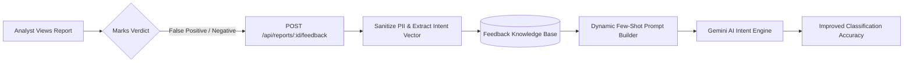

# 🚀 Mailiac Future Roadmap & Innovation Architecture

This document outlines the strategic engineering roadmap, architectural improvements, and cutting-edge feature ideas to evolve **Mailiac** from an asynchronous email forensics prototype into an enterprise-grade, autonomous SOC threat-hunting and defense ecosystem.

---

## 🎯 Executive Vision: The Autonomous Email Forensics Platform

```
┌────────────────────────────────────────────────────────────────────────────────────────┐
│                                 CURRENT STATE (V1 MVP)                                 │
│  Single-Email Asynchronous Forensics • 4-Pillar Deterministic Risk Engine • PDF Export │
└───────────────────────────────────────────┬────────────────────────────────────────────┘
                                            │
                                            ▼
┌────────────────────────────────────────────────────────────────────────────────────────┐
│                               PHASE 2: ADAPTIVE INTELLIGENCE                           │
│  Fast-Path Hash Quarantine • Dynamic IoC Feedback • Active Learning (Analyst HITL)      │
└───────────────────────────────────────────┬────────────────────────────────────────────┘
                                            │
                                            ▼
┌────────────────────────────────────────────────────────────────────────────────────────┐
│                              PHASE 3: GRAPH CAMPAIGN HUNTING                           │
│  Neo4j Knowledge Graph • MITRE ATT&CK Mapping • Coordinated Threat Actor Attribution   │
└───────────────────────────────────────────┬────────────────────────────────────────────┘
                                            │
                                            ▼
┌────────────────────────────────────────────────────────────────────────────────────────┐
│                               PHASE 4: SOAR & AUTONOMOUS REMEDIATION                   │
│  1-Click Gmail/M365 Mailbox Pull • Quishing (QR Phish) OCR • Multi-Tenant Enterprise   │
└────────────────────────────────────────────────────────────────────────────────────────┘
```

---

## 🔬 1. Continuous Learning & Threat Intelligence Feedback Loop

### 1.1 Pre-Pipeline Fast-Path Attachment Quarantine ($O(1)$)
* **Current State:** Attachments are hashed via SHA-256 during Stage 1 MIME parsing, but are not checked against a pre-existing blocklist.
* **Future Implementation:**
  * Implement an in-memory Redis Bloom filter and MongoDB `MaliciousAttachmentHash` collection populated from global threat feeds (VirusTotal, MalwareBazaar).
  * If an incoming email's attachment matches a known malware hash, the pipeline triggers an immediate **Fast-Path Early-Exit Quarantine** in $< 50\text{ms}$, skipping compute-heavy LLM calls and saving infrastructure costs.
  * Incorporate **SSDEEP fuzzy hashing** to catch polymorphic malware payloads with minor byte alterations.

### 1.2 Bi-Directional Threat Intel Sharing (MISP & AbuseIPDB)
* **Current State:** Outbound read-only queries to AbuseIPDB.
* **Future Implementation:**
  * Automatically export newly identified malicious originating IPs, lookalike domains, and phishing URLs to **MISP (Malware Information Sharing Platform)** and **AbuseIPDB Community Reporting API**.
  * Subscribe to real-time STIX/TAXII threat feeds to dynamically enrich the local reputation cache before analysis starts.

### 1.3 Self-Tuning Protected Domain & Homoglyph Matrix
* **Current State:** Static `PROTECTED_DOMAINS` watchlist and hardcoded distance cutoffs (Levenshtein $\le 2$, Jaro-Winkler $\ge 0.88$).
* **Future Implementation:**
  * Connect to Certificate Transparency logs (e.g. crt.sh) to detect newly registered lookalike domains within seconds of SSL certificate issuance.
  * Implement an adaptive scoring algorithm where distance thresholds automatically adjust based on domain length and frequency distribution in enterprise communication.

---

## 🤖 2. Human-in-the-Loop (HITL) Active Learning & Prompt Evolution



### 2.1 Analyst Feedback API & UI Flagging
* **Implementation Plan:**
  * Add a "Submit Feedback / Challenge Verdict" button on the Next.js Evidence Console (`/analysis-console/[caseId]/evidence`).
  * Introduce endpoint `POST /api/reports/:id/feedback` accepting analyst classifications (`FALSE_POSITIVE`, `FALSE_NEGATIVE`, `CORRECTED_INTENT`, `NOTES`).
  * Store feedback in a dedicated `AnalystFeedbackModel` linked to the anonymized feature vector.

### 2.2 Dynamic Few-Shot Prompt Calibration & Heuristic Auto-Expansion
* **Implementation Plan:**
  * When Gemini classifies ambiguous emails (confidence $< 0.80$), the prompt dynamically injects the top-3 most relevant anonymized edge cases from the feedback database as **few-shot examples**.
  * Use human-verified false negatives to automatically generate new regex patterns for the local heuristic engine, ensuring continuous offline improvement.

---

## 🕸️ 3. Graph-Based Campaign Clustering & Threat Actor Attribution

### 3.1 Neo4j Threat Intelligence Knowledge Graph
* **Concept:** Phishing is rarely an isolated incident—attackers launch distributed campaigns hitting multiple employees from shared infrastructure.
* **Implementation Plan:**
  * Store forensic relationships in a Neo4j Graph Database:
    ```cypher
    (:ThreatActor)-[:OPERATES_INFRASTRUCTURE]->(:OriginatingIP)
    (:OriginatingIP)-[:ROUTED_THROUGH]->(:ASN)
    (:ThreatActor)-[:REGISTERED_DOMAIN]->(:SenderDomain)
    (:SenderDomain)-[:SENT_MESSAGE]->(:VictimEmail)
    (:Message)-[:CONTAINS_PAYLOAD]->(:AttachmentHash)
    ```
  * Group individual emails into unified **Threat Campaigns** in the UI dashboard, showing metrics like:
    * Total affected targets across the organization.
    * First seen / last seen timestamps.
    * Infrastructure overlap (e.g. 15 phishing emails sent from 3 different domains using the same Bulletproof Hosting ASN).

### 3.2 Automated MITRE ATT&CK & D3FEND Mapping
* **Implementation Plan:**
  * Map forensic findings directly to the **MITRE ATT&CK for Enterprise** matrix:
    * `T1566.001` (Spearphishing Attachment)
    * `T1566.002` (Spearphishing Link)
    * `T1598.003` (Phishing for Information: Credentials)
    * `T1036.005` (Masquerading: Match Legitimate Name)
  * Output MITRE ATT&CK heatmaps on the forensic PDF report and dashboard.

---

## ⚡ 4. Autonomous Remediation & SOAR Integration

### 4.1 1-Click Mailbox Pull & Remediation
* **Google Workspace & Microsoft 365 Active Response:**
  * Enable authorized SOC analysts to perform 1-click remediation directly from the Mailiac console:
    * **Quarantine Message:** Move message to user's Spam/Trash folder across all affected inboxes.
    * **Block Sender Domain:** Push sender domain to Google Workspace / M365 tenant-wide blocklists.
    * **Revoke Active Sessions:** Force password reset / session revocation if an employee entered credentials.

### 4.2 Webhook Dispatch to SIEM/SOAR Ecosystems
* **Out-of-the-Box Integrations:**
  * Native connectors for **Splunk**, **Palo Alto Cortex XSOAR**, **Tines**, **Sublime Security**, and **Wazuh SIEM**.
  * Signed HMAC-SHA256 webhooks delivering the complete structured `AnalysisReport` for automated playbook execution.

---

## 👁️ 5. Multimodal & Next-Gen Evasion Defense

### 5.1 Quishing (QR Code Phishing) & Image OCR
* **Threat:** Attackers embed QR codes or render entire phishing messages as images (`.png`/`.jpeg`) to bypass textual email filters.
* **Implementation Plan:**
  * Integrate lightweight Computer Vision / OCR (e.g. Tesseract.js / Gemini Vision API) to extract text from inline images and decode embedded QR code URLs.
  * Feed decoded QR code destination URLs into the URL reputation and decloaking engine.

### 5.2 Dynamic PDF & Office Macro Sandbox Detonation
* **Implementation Plan:**
  * Connect to an asynchronous Cuckoo / CAPE sandbox microservice.
  * Detonate suspicious attachments (`.pdf`, `.xlsm`, `.docm`, `.iso`) in a safe virtual machine to inspect dynamic runtime behaviors (process injection, DNS beacons).

### 5.3 Multilingual & Regional Scam Detection
* **Implementation Plan:**
  * Expand semantic NLP evaluation with multilingual localized embeddings (supporting Hindi, Spanish, Portuguese, German, French, and Japanese).
  * Build specialized lure taxonomies for regional scam vectors (e.g. UPI payment fraud, Income Tax refund lures, Aadhaar/KYC verification traps).

---

## 🏢 6. Enterprise Infrastructure & Deployment Scaling

| Capability | MVP Prototype | Enterprise Target (V2) |
|---|---|---|
| **Deployment** | Docker Compose (Single Host) | Multi-Region Kubernetes (EKS / GKE) with Helm Charts |
| **Broker Scalability** | Single Redis Instance | Redis Cluster + BullMQ Pro with Sharded Queue Partitions |
| **Cold Storage** | Transient MongoDB (24h TTL) | AWS S3 / MinIO Glacier with KMS Envelope Encryption |
| **Authentication** | Session / OAuth 2.0 Client | Enterprise SSO (SAML 2.0, Okta, Azure AD, OAuth OIDC) |
| **Rate Limiting** | Express In-Memory Limits | Envoy / Kong API Gateway with Token Bucket Rate Limiting |
| **Compliance** | SOC-ready logging | Full GDPR / HIPAA compliance with cryptographic Audit Trail |

---

## 📅 Roadmap Delivery Timeline

```
Q1 2026: Phase 1 — Core Intelligence (COMPLETE ✅)
├── 9-Step Parallel Forensics Pipeline
├── Deterministic 4-Pillar Corroboration Engine
├── Dual Ingestion (Manual .EML + Gmail OAuth 2.0)
└── Zero-Dependency Forensic PDF 1.4 Export

Q2 2026: Phase 2 — Adaptive Intelligence & Active Learning
├── Fast-Path SHA-256 / SSDEEP Attachment Quarantine Blocklist
├── Analyst Feedback API & UI (False-Positive Reporting)
├── Dynamic Few-Shot Prompt Calibration for Gemini AI
└── Real-Time Domain Registration Intelligence (Certificate Transparency)

Q3 2026: Phase 3 — Graph Attribution & Threat Hunting
├── Neo4j Threat Actor & Infrastructure Knowledge Graph
├── Automated Campaign Clustering across Organization
├── MITRE ATT&CK Technique Mapping Matrix
└── Quishing (QR Code Phishing) & Multimodal Image OCR

Q4 2026: Phase 4 — Autonomous SOAR & Enterprise Scale
├── 1-Click Mailbox Pull for Google Workspace & Microsoft 365
├── Native SIEM Connectors (Splunk, Cortex XSOAR, Tines)
├── Kubernetes Helm Deployment & S3 Encrypted Cold Storage
└── Multilingual Regional Scam Taxonomy (UPI / Tax / Banking)
```
