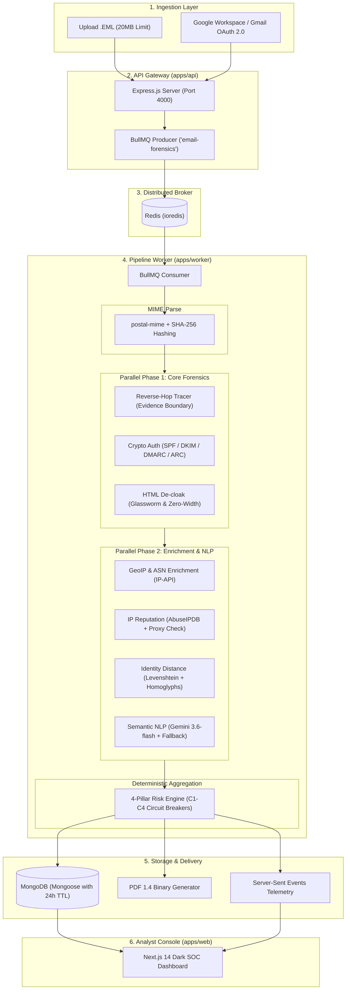

# 🏛️ Mailiac Architecture & Threat Engine Report

## 1. Executive Summary

**Mailiac** is an enterprise-grade, high-throughput email forensics and threat-hunting platform designed to dissect, analyze, and neutralize advanced cyber threats—including Business Email Compromise (BEC), spear phishing, lookalike domain spoofing, and zero-width evasion attacks.

Built as a strict TypeScript **Turborepo monorepo**, Mailiac implements an asynchronous 9-step forensics pipeline driven by **BullMQ** and **Redis**, backed by **MongoDB**, and rendered in a real-time **Next.js 14** SOC evidence console.

The cornerstone of Mailiac is its **Deterministic 4-Pillar Corroboration Risk Engine**. Unlike naive security wrappers that send entire unvetted email bodies to an LLM and blindly execute the response, Mailiac sandboxes semantic AI as one of four independently weighted forensic pillars. By fusing mathematical distance checks, cryptographic signature verification, network hop tracing, and constrained NLP, Mailiac completely eliminates AI hallucination vulnerabilities and prevents prompt injection bypasses.

---

## 2. High-Level System Architecture

---

## 3. Monorepo Structure & Package Boundaries

Mailiac enforces strict isolation between ingestion, orchestration, pure algorithmic functions, and data models. Packages communicate strictly through typed contracts defined in `@mailiac/shared-types`.

### Applications (`apps/`)

| App | Stack | Responsibility |
|---|---|---|
| **`apps/api`** | Express, TypeScript, Multer, Google APIs | HTTP Gateway: Multipart upload, Gmail OAuth flow, job status polling, reports API, PDF download, and SSE streams. |
| **`apps/worker`** | BullMQ, ioredis, TypeScript | Asynchronous pipeline worker: Executes the 9-stage analysis pipeline across parallelized phases. |
| **`apps/web`** | Next.js 14 (App Router), Tailwind CSS, Recharts, Leaflet | SOC Analyst Dashboard: Real-time status tracking, 4-pillar risk breakdown, geographic hop map, Gmail inbox drawer, and evidence explorer. |

### Domain Packages (`packages/`)

| Package | Entrypoint Function | Responsibility |
|---|---|---|
| **`@mailiac/shared-types`** | `src/index.ts` | **Frozen Contract**: Holds shared interfaces (`MDM`, `ForensicHop`, `AuthResult`, `IdentityResult`, `RiskMatrix`, `AnalysisReport`). |
| **`@mailiac/db`** | `connectDb()`, Models | Mongoose models for `AnalysisReportModel`, `RawEmailModel` (re-analysis buffer store), `AnalystFeedbackModel` (SOC reviews), `GmailAccountModel`, `EmailAnalysisRecordModel`, and TTL expiration indexes. |
| **`@mailiac/parsing/mime`** | `parseEmlToMdm()` | Converts raw RFC 822 buffers to structured `MDM` and generates SHA-256 attachment hashes. |
| **`@mailiac/parsing/decloak`** | `decloakHtml()` | Detects zero-width evasion Unicode characters and strips hidden tracking structures. |
| **`@mailiac/parsing/geoip`** | `enrichHopsWithGeo()` | Enriches IP hops with geolocation coordinates, city/country, and ASN info. |
| **`@mailiac/parsing/ai-intent`** | `scoreIntent()` | Multi-Model & Multi-Key Failover Router (`gemini-3.1-flash-lite`, `gemini-3.5-flash`, `gemini-3.6-flash`), `InMemoryHealthTracker` cooldown engine, and deterministic local heuristic fallback. |
| **`@mailiac/scoring/reverse-hop`**| `traceReverseHops()` | Parses `Received` headers, detects private-to-public evidence boundaries, and flags proxy injection. |
| **`@mailiac/scoring/auth`** | `verifyAuth()` | Cryptographically verifies SPF, DKIM, DMARC, and ARC authentication. |
| **`@mailiac/scoring/identity`** | `scoreIdentity()` | Evidence-Gated Levenshtein, Damerau-Levenshtein, and Jaro-Winkler homoglyph spoofing detector (suppresses false positives on legitimate subdomains). |
| **`@mailiac/scoring/ip-reputation`**| `scoreIpReputation()`| AbuseIPDB threat score, Tor/VPN/proxy detection, and timezone drift checks. |
| **`@mailiac/scoring/risk-engine`** | `aggregateRisk()` | 4-pillar mathematical aggregator enforcing corroboration rules and circuit breakers. |
| **`@mailiac/reporting/pdf`** | `generateForensicPdf()` | Zero-dependency binary PDF 1.4 forensic report generator. |
| **`@mailiac/webhooks`** | `signPayload()` | HMAC-SHA256 signature generator for outbound webhook security. |

---

## 4. Ingestion & Re-Analysis Architecture

Mailiac accommodates flexible ingestion and case audit modes without compromising pipeline uniformity:

1. **Manual EML Upload (`POST /api/upload`)**:
   - Accepts raw `.eml` multipart uploads up to 20MB.
   - Enqueues raw bytes directly into BullMQ `email-forensics` queue and archives payload into `RawEmailModel`.
   - Immediately returns `202 Accepted` with a tracking `jobId`.

2. **On-Demand Gmail OAuth 2.0 (`/api/gmail/*`)**:
   - Connects user account via Google OAuth 2.0 using least-privilege `gmail.readonly` scope.
   - Lists message metadata (Sender, Subject, Snippet, Date) without downloading email bodies.
   - When the user selects an email and clicks **"Analyze with Mailiac"**, the backend fetches *only that specific message* as raw RFC 822 bytes (`format: 'raw'`).
   - Dispatches the exact same byte buffer into BullMQ and persists to `RawEmailModel`, achieving 100% forensic parity with manual uploads.

3. **In-Place Case Re-Analysis (`POST /api/reports/:id/reanalyze`)**:
   - Allows SOC analysts to re-trigger analysis on previously parsed emails after rule updates or intelligence feed refresh.
   - Operates strictly under the original canonical `messageId` to maintain zero-duplicate database hygiene.
   - Recovers raw MIME bytes through a tiered fallback strategy: `RawEmailModel` in MongoDB → BullMQ job data in Redis → on-demand Gmail API fetch.

---

## 5. The 4-Pillar Deterministic Risk Engine

### Weight Formula
$$\text{BaseScore} = (0.35 \times S_{\text{identity}}) + (0.35 \times S_{\text{nlp}}) + (0.20 \times S_{\text{auth}}) + (0.10 \times S_{\text{ip}})$$

### Evidence-Based Circuit Breakers
- **$C_1$ (Definite Spoofing):** Identity Spoof $\ge 85 \land$ Auth Failure $\ge 70 \implies \text{QUARANTINE}$
- **$C_2$ (Malicious Impersonation):** Identity Spoof $\ge 85 \land$ AI Malicious Intent $\ge 70 \implies \text{QUARANTINE}$
- **$C_3$ (Multi-Pillar Consensus):** $\ge 3$ pillars with score $\ge 70 \implies \text{QUARANTINE}$
- **$C_4$ (AI Hallucination Immunity):** Auth, Identity, and IP all clean ($\le 20$) $\implies$ Cap Final Score at 40 (**SAFE** / **FLAG** only, preventing false quarantine).

---

## 6. Storage & Data Lifecycle

- **Transient MongoDB TTL:** Analysis reports are tagged with `expireAt` (24-hour TTL index), auto-pruning old records to optimize disk usage.
- **Durable Raw Email Persistence (`RawEmailModel`):** Preserves immutable RFC 822 byte buffers to empower seamless in-place forensic re-analysis without requiring manual file re-upload.
- **Human-in-the-Loop Feedback (`AnalystFeedbackModel`):** Records analyst verdicts (`CONFIRMED_TRUE_POSITIVE`, `FALSE_POSITIVE`, etc.), suggested scores, and pillar accuracy grading for active learning and audit trails.
- **Deduplication Engine:** `EmailAnalysisRecordModel` uses sparse unique indexes on `gmailMessageId` and `jobId` to avoid redundant duplicate analysis records on re-runs.

---

## 7. Security & Non-Negotiable Invariants

1. **Strict TypeScript Mode & Frozen Contract:** `packages/shared-types` remains the immutable source of truth across all packages.
2. **Deterministic Fallbacks:** All external calls (Gemini API, GeoIP, AbuseIPDB) are wrapped with strict timeouts and local heuristic fallback engines so the pipeline never hangs.
3. **Queue Isolation:** BullMQ queue operations remain strictly isolated in `apps/api` and `apps/worker`. All packages remain pure, queue-agnostic functions.
