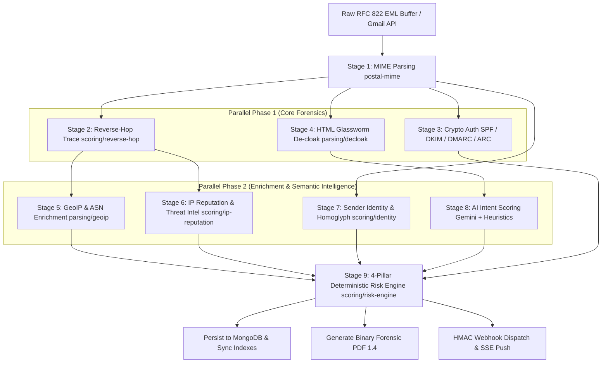
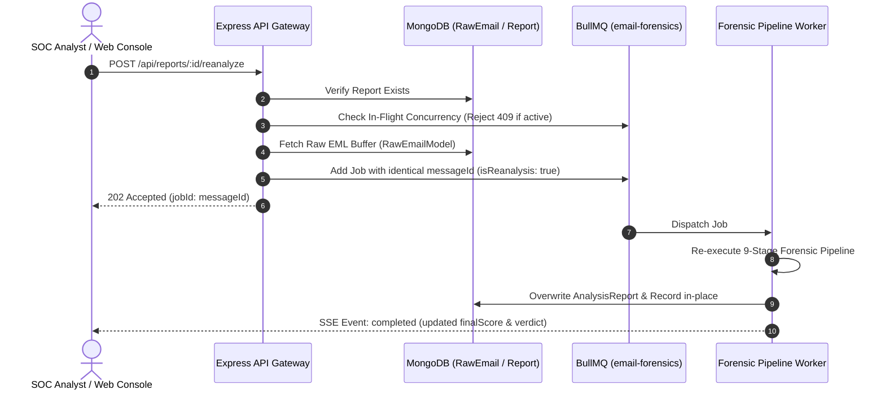

# 🔬 Mailiac Pipeline & 4-Pillar Risk Engine Deep Dive

This document provides the definitive mathematical and algorithmic breakdown of Mailiac's **9-Step Asynchronous Forensics Pipeline** and **Deterministic 4-Pillar Threat Aggregation Engine**.

---

## ⚡ Execution Architecture & Timeline

To maximize throughput and minimize latency, the pipeline executes stages using **two parallel phases** before running the deterministic risk engine:



---

## 🔍 Detailed Stage Breakdown

### Stage 1: MIME Deconstruction (`packages/parsing/mime`)
- Parses raw RFC 822 emails into the frozen **Message Data Model (MDM)** without data truncation.
- Computes SHA-256 hashes and MIME type categorizations for all attachments.
- Normalizes headers (`Subject`, `From`, `Reply-To`, `Date`, `Received`).

### Stage 2: Reverse-Hop Trace (`packages/scoring/reverse-hop`)
- Parses all `Received` headers in reverse order (bottom-up from originating MUA to edge MTA).
- Detects the **Evidence Boundary**: the handoff where private/internal IPs (`10.0.0.0/8`, `172.16.0.0/12`, `192.168.0.0/16`) transition to the first public routing IP.
- Performs reverse DNS PTR validation to identify proxy injection and forged relay headers.

### Stage 3: Cryptographic Authentication (`packages/scoring/auth`)
- Validates **SPF** (`pass`, `fail`, `neutral`, `none`), **DKIM** (RSA/Ed25519 signature validation), and **DMARC** policy alignment (`strict`, `relaxed`, `fail`).
- Validates **Authenticated Received Chain (ARC)** to verify multi-hop forwarded emails without false positives.

### Stage 4: HTML Glassworm De-cloaking (`packages/parsing/decloak`)
- Scans HTML bodies for zero-width characters (Unicode `U+200B`, `U+200C`, `U+200D`, `U+FEFF`) used to evade AI/NLP keyword matching.
- Extracts hidden tracking pixels, zero-font text (`font-size: 0px`, `display: none`), and unmasks obscured hyperlinks.

### Stage 5: GeoIP & ASN Hop Enrichment (`packages/parsing/geoip`)
- Maps public IP hops in the routing path to physical locations (City, Country, Latitude/Longitude coordinates, ASN).
- Annotates hops with network trust indicators for Leaflet geographic map visualization.

### Stage 6: IP Reputation & Threat Intel (`packages/scoring/ip-reputation`)
- Queries AbuseIPDB threat intelligence database for historical abuse confidence scores.
- Detects Tor exit nodes, public VPNs, and residential proxies.
- Evaluates timezone anomalies (discrepancy between sender `Date` header and origin IP timezone).

### Stage 7: Sender Identity & Evidence-Gated Spoof Defense (`packages/scoring/identity`)
- Computes string edit distances (**Levenshtein**, **Damerau-Levenshtein**, **Jaro-Winkler**) between the sender domain and protected enterprise domains.
- Detects Unicode homoglyph substitution attacks (e.g. `pаypal.com` with Cyrillic 'а') and punycode (`xn--`) labels.
- **Evidence-Gated Similarity Detection:** Pure syntactic similarity does not flag legitimate subdomains or partner domains. Suspicious distance flags are evidence-gated by requiring corroborating deceptive indicators (unaligned display names, free-mail sender spoofing, or missing reverse DNS).
- Inspects display name spoofing (e.g., `"CEO Name" <attacker@free-mail.com>`).

### Stage 8: Multi-Model AI Intent Scoring & Failover Router (`packages/parsing/ai-intent`)
- **Multi-Model Candidate Prioritization:** Dispatches requests through prioritized Gemini models (`gemini-3.1-flash-lite`, `gemini-3.5-flash`, `gemini-3.6-flash`) combined with multi-key rotation pools.
- Evaluates semantic manipulation, psychological urgency, credential harvesting requests, authority traps, and financial coercion.
- **Autonomous Health Tracker (`InMemoryHealthTracker`):**
  - **HTTP 429 (`RATE_LIMIT`):** Automatically puts the rate-limited API key on dynamic cooldown (reading `Retry-After` header or 60s default) and seamlessly tries the next key on the same model.
  - **HTTP 503/504 (`MODEL_UNAVAILABLE`):** Places the overloaded model on 120s cooldown and instantly skips remaining pairs with this model, switching immediately to the fallback model.
  - **HTTP 401/403 (`INVALID_KEY`):** Permanently evicts the revoked key from the memory pool.
  - **HTTP 404 (`MODEL_NOT_FOUND`):** Permanently blacklists deprecated or unavailable model names.
  - **Timeouts & Network Jitter:** Applies a 150–300ms backoff and retries the next candidate route up to `GEMINI_MAX_ATTEMPTS`.
- **Fail-Safe Heuristic Fallback:** If all candidate models/keys are exhausted or offline, the engine fuses deterministic regex and keyword heuristics, guaranteeing zero unhandled worker exceptions and 100% pipeline liveness.
- **Safe Provenance Audit:** Emits `AI_ROUTER_FAILOVER` or `AI_ROUTER_EXHAUSTED` findings documenting failover steps without exposing raw API keys or body PII.

---

## ⚖️ The Deterministic 4-Pillar Risk Engine

The `packages/scoring/risk-engine` evaluates risk mathematically rather than trusting raw LLM verdicts.

### 1. Pillar Weight Distribution

$$\text{BaseScore} = (W_{\text{auth}} \times S_{\text{auth}}) + (W_{\text{identity}} \times S_{\text{identity}}) + (W_{\text{ip}} \times S_{\text{ip}}) + (W_{\text{nlp}} \times S_{\text{nlp}})$$

| Pillar | Weight ($W$) | Description |
|---|---|---|
| **Identity Authentication** | **35%** ($0.35$) | Typosquatting, homoglyphs, and display-name spoofing |
| **Semantic AI Intent** | **35%** ($0.35$) | Psychological urgency, coercion, and credential harvesting |
| **Cryptographic Auth** | **20%** ($0.20$) | SPF, DKIM, DMARC, and ARC validation failures |
| **Infrastructure / IP** | **10%** ($0.10$) | Originating IP abuse score, proxy/VPN, and timezone drift |

---

### 2. Multi-Pillar Corroboration Bonus

If multiple independent pillars detect strong threat signals ($\ge 70$), a corroboration bonus is added:

- **2 Strong Pillars:** $+10$ points
- **3 Strong Pillars:** $+20$ points
- **4 Strong Pillars:** $+30$ points

$$\text{FinalScore} = \min(100, \text{BaseScore} + \text{Bonus})$$

---

### 3. Evidence-Based Circuit Breakers ($C_1 - C_4$)

To prevent sophisticated bypasses, the risk engine enforces deterministic override conditions:

| Rule | Trigger Condition | Override Result | Rationale |
|---|---|---|---|
| **$C_1$** | $S_{\text{identity}} \ge 85 \land S_{\text{auth}} \ge 70$ | **QUARANTINE** ($\text{FinalScore} \ge 85$) | Definite spoofing: Lookalike domain with failed crypto verification. |
| **$C_2$** | $S_{\text{identity}} \ge 85 \land S_{\text{nlp}} \ge 70$ | **QUARANTINE** ($\text{FinalScore} \ge 85$) | Malicious Impersonation: Lookalike domain exhibiting urgent financial/credential solicitation. |
| **$C_3$** | $\ge 3\text{ pillars with } \text{Score} \ge 70$ | **QUARANTINE** ($\text{FinalScore} \ge 85$) | Multi-pillar consensus: Three independent forensic vectors detect high threat. |
| **$C_4$** | $S_{\text{auth}} \le 20 \land S_{\text{identity}} \le 20 \land S_{\text{ip}} \le 20$ | **SAFE** (Cap at 40) | Immune to AI Hallucinations: If crypto, identity, and network are clean, single AI flag cannot trigger quarantine. |

---

## 📊 Verdict Classification Bands

```
 0               30                     70                100
 ├────────────────┼──────────────────────┼──────────────────┤
 │      SAFE      │         FLAG         │    QUARANTINE    │
 │ (Low Threat)   │ (Review Recommended) │ (High Risk Phish)│
 └────────────────┴──────────────────────┴──────────────────┘
```

- **SAFE (0 – 29):** All authentication passes; clean sender reputation and low semantic risk.
- **FLAG (30 – 69):** Moderate risk (e.g. unverified sender with neutral body, or legitimate sender with unusual urgency).
- **QUARANTINE (70 – 100):** High-confidence threat (BEC, active credential harvesting, lookalike domain spoofing).

---

## 🔄 In-Place Case Re-Analysis

Mailiac allows SOC analysts to trigger on-demand re-analysis of previously investigated emails via `POST /api/reports/:id/reanalyze`.



1. **Zero-Duplicate Hygiene:** Re-analysis operates under the original canonical `messageId`, updating records in-place rather than polluting forensic history with duplicate case IDs.
2. **Buffer Survivability:** EML bytes are durably preserved in `RawEmailModel`. If an email was ingested via Gmail OAuth and deleted from local cache, the pipeline dynamically re-fetches raw bytes via Google APIs.

---

## 👥 Human-in-the-Loop Feedback & Active Learning

Analyst reviews can be recorded directly against cases via `POST /api/reports/:id/feedback`:

- **Verdict Ground Truth:** Supports explicit classifications (`CONFIRMED_TRUE_POSITIVE`, `CONFIRMED_TRUE_NEGATIVE`, `FALSE_POSITIVE`, `FALSE_NEGATIVE`, `MISCLASSIFIED_SEVERITY`, etc.).
- **Pillar Accuracy Grading:** Captures boolean accuracy per pillar (`auth`, `identity`, `ip`, `nlp`) to identify drift or blindspots.
- **Continuous Calibration:** Feeds the future risk weighting calibration and supervised fine-tuning loops.

